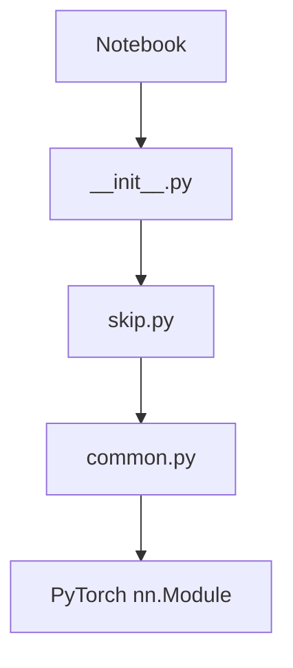

# Deep Image Prior — Intern Onboarding & Mentorship Guide

Welcome to the team! I'm glad you're joining us. Over the next few hours, I'm going to walk you through the Deep Image Prior (DIP) repository exactly the way I wish someone had taught me. 

We aren't going to talk much about the paper's math. Instead, we are going to treat this as a living, breathing codebase. By the end of this session, you won't just understand this code—you'll own it, and you'll be able to confidently hack it apart for your own research.

Grab a coffee, and let's pair-program.

---

## PART 1 — How do I run this project?

Before we look at code, let's get your machine running.

### What software do I need?
- **Python Version**: 3.6+ (though modern 3.8-3.10 works perfectly fine).
- **PyTorch Version**: The code was originally written for PyTorch 0.4, but it runs smoothly on modern PyTorch (e.g., 1.10 - 2.0+) because it uses standard ops.
- **Packages**: `torch`, `torchvision`, `numpy`, `matplotlib`, `Pillow` (PIL), `scikit-image` (for PSNR metrics).
- **Hardware**: You *can* run this on a CPU, but it will take forever. You need an NVIDIA GPU with **CUDA**. Even a modest GPU (like a GTX 1060) is fine because we only optimize one image at a time, so VRAM usage is tiny (~1-2 GB).
- **Environment**: Jupyter Notebook or JupyterLab.

### How do I install everything?
I highly recommend using Conda to keep your dependencies clean. Run these commands in your terminal:

```bash
# 1. Create a clean environment
conda create -n dip_env python=3.9 -y
conda activate dip_env

# 2. Install PyTorch (adjust the CUDA version based on your GPU)
conda install pytorch torchvision torchaudio pytorch-cuda=11.8 -c pytorch -c nvidia

# 3. Install the rest of the dependencies
pip install numpy matplotlib scikit-image jupyter

# 4. Clone the repo (if you haven't)
git clone https://github.com/DmitryUlyanov/deep-image-prior.git
cd deep-image-prior
```

### How do I launch and verify?
Run `jupyter notebook` in your terminal. Open `denoising.ipynb`.

To know your GPU is working, add this tiny cell at the top of the notebook and run it:
```python
import torch
print(torch.cuda.is_available()) # Should print True
print(torch.cuda.get_device_name(0)) # Should print your GPU name
```

When you run the notebook, you should see a progress log printing Iteration, Loss, and PSNR. Every 100 iterations, a plot will appear showing the network's current prediction side-by-side with the exponential moving average (EMA) prediction.

---

## PART 2 — Repository Tour

Let's open the folder together. Here is what we see:

```text
deep-image-prior/
├── data/                  # Sample images for testing.
├── models/                # Neural network architectures.
├── utils/                 # Image processing and optimization loops.
├── denoising.ipynb        # Entry point for denoising.
├── inpainting.ipynb       # Entry point for fixing missing pixels.
└── super-resolution.ipynb # Entry point for upscaling.
```

### Why no `main.py`?
This is a *research repository*. The authors used Jupyter Notebooks as their entry points so they could visually inspect the images as they trained.

Let's rate the files by importance so you know where to focus:

- **`denoising.ipynb`** (★★★★★ Critical)
  - *Why?* This is your main loop. You run it to do the experiment.
  - *Who calls it?* You do.
- **`utils/common_utils.py`** (★★★★★ Critical)
  - *Why?* Contains `optimize()` which runs the training loop, and `get_noise()` which creates the input tensor.
  - *Who calls it?* The notebook.
- **`models/skip.py`** (★★★★ Important)
  - *Why?* The core U-Net style architecture. The "prior" lives inside the structure of this network.
  - *Who calls it?* `models/__init__.py`.
- **`models/common.py`** (★★★★ Important)
  - *Why?* Contains the `Concat` block and `conv` block. It handles tensor size mismatches.
- **`models/__init__.py`** (★★★ Useful)
  - *Why?* A factory that returns the network based on a string name (`'skip'`, `'UNet'`, etc).
- **`utils/denoising_utils.py`** (★★ Optional)
  - *Why?* Just contains `get_noisy_image()`.

---

## PART 3 — Execution Walkthrough (denoising.ipynb)

Pretend you press "Run All". Let's trace it cell by cell.

### Cell 1 & 2: Imports & Setup
```python
import numpy as np
from models import *
import torch
from utils.denoising_utils import *
```
- **What happens:** Imports libraries. Enables CuDNN benchmarking (makes convolutions faster). Sets `dtype = torch.cuda.FloatTensor` so everything defaults to the GPU.
- **Common mistake:** If you run this on a Mac or CPU machine, `torch.cuda.FloatTensor` will throw an error. You'd change it to `torch.FloatTensor`.

### Cell 3 & 4: Loading the Image
```python
fname = 'data/denoising/F16_GT.png'
img_pil = crop_image(get_image(fname, imsize)[0], d=32)
img_np = pil_to_np(img_pil)
img_noisy_pil, img_noisy_np = get_noisy_image(img_np, sigma_)
```
- **Why it exists:** We need a corrupted image to reconstruct.
- **What it does:** Loads the F16 jet image, crops it so its dimensions are divisible by 32, and adds artificial Gaussian noise.
- **Why divisible by 32?** The U-Net downsamples the image 5 times (factor of 2 each time, $2^5 = 32$). If the image is 33x33, halving it causes fractional dimensions, which crashes the network during upsampling.

### Cell 5: Setup & Network Init
```python
INPUT = 'noise'
OPT_OVER = 'net'
LR = 0.01

net = get_net(input_depth=32, 'skip', pad, ...).type(dtype)
net_input = get_noise(32, INPUT, (img_pil.size[1], img_pil.size[0])).type(dtype).detach()
mse = torch.nn.MSELoss().type(dtype)
img_noisy_torch = np_to_torch(img_noisy_np).type(dtype)
```
- **Variables created:** 
  - `net`: The PyTorch U-Net model.
  - `net_input`: A `[1, 32, H, W]` tensor of random uniform noise. This is our fixed latent vector $z$.
  - `img_noisy_torch`: A `[1, 3, H, W]` tensor of the noisy image (our target $x_0$).

### Cell 6: The Optimization Closure
```python
net_input_saved = net_input.detach().clone()
out_avg = None

def closure():
    global i, out_avg, net_input
    
    # 1. Jitter the input noise slightly (Regularization)
    net_input = net_input_saved + (noise.normal_() * reg_noise_std)
    
    # 2. Forward pass
    out = net(net_input)
    
    # 3. Smoothing (Exponential Moving Average)
    if out_avg is None: out_avg = out.detach()
    else: out_avg = out_avg * 0.99 + out.detach() * 0.01
            
    # 4. Loss
    total_loss = mse(out, img_noisy_torch)
    total_loss.backward()
    
    return total_loss

p = get_params(OPT_OVER, net, net_input)
optimize(OPTIMIZER, p, closure, LR, num_iter)
```
- **Why this exists:** PyTorch's LBFGS optimizer requires a "closure" function that clears gradients, evaluates, and returns the loss. The authors chose to use this closure for Adam as well for consistency.
- **What it does:** This is the beating heart of DIP. It takes the noise, pushes it through the network, calculates loss against the *corrupted* image, and backpropagates.
- **Common mistake:** Putting `net_input.requires_grad = True` when you only want to optimize the network. `get_params` handles this based on `OPT_OVER`.

---

## PART 4 — Execution Timeline

Here is how the data flows over time.

**Initialization Stage**
1. Read PNG (`get_image`) $\to$ PIL Image
2. Generate synthetic noise (`get_noisy_image`)
3. Initialize Model (`get_net`)
4. Initialize random tensor `net_input` (`get_noise`)

**Training Loop (Happens 3000 times)**
5. `optimizer.zero_grad()`
6. Add tiny noise jitter to `net_input`
7. Forward Pass: `out = net(net_input)`
8. Calculate `mse(out, img_noisy_torch)`
9. `loss.backward()` (calculates gradients inside `net`)
10. `optimizer.step()` (updates `net` weights)
11. Print PSNR metric.

**Final Stage**
12. Exit loop.
13. Plot the final `out_avg` tensor as an image.

---

## PART 5 — Function Explorer

Let's look at the absolute must-know functions.

### `get_noise(input_depth, method, spatial_size)`
- **File:** `utils/common_utils.py`
- **Purpose:** Creates the fixed noise tensor $z$.
- **Outputs:** Tensor of shape `[1, input_depth, H, W]`.
- **Theory:** This is the anchor point in latent space. DIP doesn't train on a dataset; it finds a mapping from *this specific noise tensor* to the target image.

### `skip(...)`
- **File:** `models/skip.py`
- **Purpose:** Builds the U-Net architecture.
- **Outputs:** `nn.Sequential` model.
- **Internal:** Loops over `num_channels_down` and `num_channels_up` to build encoder and decoder blocks recursively.
- **Theory:** The implicit bias of DIP lives here. The architecture restricts the output to look like a natural image.

### `Concat.forward(input)`
- **File:** `models/common.py`
- **Purpose:** Concatenates encoder feature maps with decoder feature maps (skip connections).
- **Internal (CRITICAL):** If the spatial sizes (Height/Width) of the two tensors don't match, it mathematically calculates the difference and **crops** the larger tensor from the center so they match before calling `torch.cat`.
- **Implementation vs Theory:** Pure implementation convenience to avoid shape mismatch errors.

### `optimize(optimizer_type, parameters, closure, LR, num_iter)`
- **File:** `utils/common_utils.py`
- **Purpose:** The training loop.
- **Internal:** Instantiates `torch.optim.Adam`. Runs a `for` loop `num_iter` times, calling `optimizer.zero_grad()`, `closure()`, and `optimizer.step()`.

---

## PART 6 — Models Folder

Let's peek inside `models/`.

- **`skip.py`**: The main U-Net architecture. Yes, the notebook uses this. You'll spend a lot of time here if you modify the network.
- **`common.py`**: Contains the Lego bricks. `conv()`, `bn()`, `act()`, and `Concat`. Highly coupled to `skip.py`.
- **`unet.py`**: An alternative U-Net without the complex skip-connection channel reductions. Rarely used in the main notebooks.
- **`texture_nets.py`**: Used specifically for texture generation experiments (a different paper application).
- **`downsampler.py`**: Contains `Lanczos` downsampling. Used mostly in super-resolution.

**Dependency Diagram for Models:**


---

## PART 7 — Utils Folder

Inside `utils/`:

- **`common_utils.py`**: **Do not delete.** Contains `crop_image`, `get_noise`, converters (`pil_to_np`), and `optimize`. You can safely modify it if you want to change the training loop (e.g., adding a learning rate scheduler).
- **`denoising_utils.py`**: Very small. Just adds Gaussian noise.
- **`sr_utils.py`**: Super-Resolution utils. Crucially, it contains `tv_loss(x, beta)`. Total Variation loss penalizes adjacent pixels from being too different. You'll use this often if you want smoother images.

---

## PART 8 — Live Debugging Session

Imagine we are at Iteration 500 of denoising, and I pause the debugger right after `out = net(net_input)`. What does memory look like?

- **Device:** Everything is on `cuda:0`.
- **`img_noisy_torch` (Target)**: `[1, 3, 512, 512]`. Pixel values range roughly `[0.0, 1.0]`. It looks grainy.
- **`net_input` (Input)**: `[1, 32, 512, 512]`. Pure noise.
- **`net`**: A `Sequential` object containing hundreds of conv layers. `net.training` is `True`.
- **`out` (Prediction)**: `[1, 3, 512, 512]`. It looks like a slightly blurry, mostly clean F16 jet. It has gradients attached (`grad_fn=<SigmoidBackward>`).
- **`optimizer` state**: Adam holds momentum and variance buffers for every single weight in `net`.

When I step over `total_loss.backward()`:
- `out` remains the same.
- PyTorch traverses the graph backward. Now, every weight in `net` has a `.grad` tensor populated.

When I step over `optimizer.step()`:
- The weights in `net` are slightly modified in the direction opposite to the gradients.

---

## PART 9 — Follow the Data

Let's track a single image being processed for denoising.

1. **`F16_GT.png`** (File on disk)
2. $\downarrow$ `Image.open()`
3. **PIL Object** (Size: 512x512, Mode: RGB, Values: 0-255)
4. $\downarrow$ `pil_to_np()`
5. **NumPy Array** `img_np` (Shape: `[3, 512, 512]`, dtype: float32, Values: 0.0-1.0)
6. $\downarrow$ `get_noisy_image()`
7. **NumPy Array** `img_noisy_np` (Shape: `[3, 512, 512]`, Gaussian noise added, clipped to 0-1).
8. $\downarrow$ `np_to_torch()`
9. **PyTorch Tensor** `img_noisy_torch` (Shape: `[1, 3, 512, 512]`, Device: GPU). This is our target!

Meanwhile, the input generation:
10. `torch.zeros([1, 32, 512, 512])`
11. $\downarrow$ `.uniform_()`
12. **PyTorch Tensor** `net_input` (Shape: `[1, 32, 512, 512]`, random noise).

The Pipeline:
13. `out = net(net_input)` $\to$ Result is `[1, 3, 512, 512]` prediction.
14. `loss = mse(out, img_noisy_torch)` $\to$ Result is a Scalar (e.g., `0.024`).
15. `loss.backward()` $\to$ Populates gradients in `net`.

---

## PART 10 — Follow the Network

Let's track `net_input` shape as it flows through the `skip` network (assuming a 512x512 image).

| Layer Stage | Operation | Channels | Height | Width |
| :--- | :--- | :--- | :--- | :--- |
| **Input** | `net_input` | 32 | 512 | 512 |
| **Down 1** | `Conv` (stride=2) | 128 | 256 | 256 |
| **Down 2** | `Conv` (stride=2) | 128 | 128 | 128 |
| **Down 3** | `Conv` (stride=2) | 128 | 64 | 64 |
| **Down 4** | `Conv` (stride=2) | 128 | 32 | 32 |
| **Down 5** (Deepest)| `Conv` (stride=2) | 128 | 16 | 16 |
| **Up 1** | `Upsample` (x2) | 128 | 32 | 32 |
| **Concat 1** | Merge w/ Skip | 128 + 4 = 132 | 32 | 32 |
| **Up 2** | `Upsample` (x2) | 128 | 64 | 64 |
| ... | ... | ... | ... | ... |
| **Up 5** | `Upsample` (x2) | 128 | 512 | 512 |
| **Output** | `Conv` (1x1) + Sigmoid | 3 | 512 | 512 |

Notice how the Skip connection passes a heavily compressed 4-channel representation across the network.

---

## PART 11 — Follow the Optimizer

Why does the output improve without any training data?

1. **Forward:** The random noise passes through the random network weights. The output looks like random garbage.
2. **Loss:** The garbage output is compared to the F16 jet. The MSE loss is huge.
3. **Backward:** PyTorch says, "If weight $W_1$ was slightly larger, the output would look 0.001% more like an F16 jet."
4. **Step:** Adam updates $W_1$.
5. **The Magic (Why it works):** Because of the U-Net's convolutions, it is *mathematically easier* for the network weights to arrange themselves into smooth, natural shapes (like a jet wing) than into high-frequency random dots (the noise). Therefore, gradient descent naturally reconstructs the jet first.
6. **Early Stopping:** If we stop the optimizer at Iteration 3000, we have the jet, but the network hasn't had time to "memorize" the noise.

---

## PART 12 — Variable Dictionary

| Variable | Type | Shape | Created Where | Destroyed Where | Purpose |
| :--- | :--- | :--- | :--- | :--- | :--- |
| `img_noisy_torch`| Tensor | `[1, 3, H, W]`| Notebook setup | Never | The degraded target image. |
| `net_input` | Tensor | `[1, 32, H, W]`| `get_noise()` | Never (modified) | The fixed random latent vector $z$. |
| `net` | nn.Module | N/A | `get_net()` | Never | The U-Net structural prior. |
| `out` | Tensor | `[1, 3, H, W]`| `closure()` | End of iteration | Current prediction for visualization/loss. |
| `out_avg` | Tensor | `[1, 3, H, W]`| `closure()` | Never | Smoothed prediction (looks much better). |
| `total_loss` | Scalar | `[1]` | `closure()` | End of iteration | Gradients propagate back from this. |

---

## PART 13 — Common Errors & How to Fix Them

You *will* hit these errors. Here is how you debug them.

1. **`RuntimeError: CUDA out of memory.`**
   - *Why:* You passed a massive image (e.g., 4K resolution) and the U-Net feature maps can't fit in VRAM.
   - *Fix:* Crop or resize the image in the notebook before passing it to the network.

2. **`RuntimeError: Sizes of tensors must match except in dimension 1 (Concat mismatch).`**
   - *Why:* Your image dimensions weren't perfectly divisible by $2^{\text{depth}}$. The upsampled tensor is, say, 128x128, but the skip connection is 129x129. 
   - *Fix:* The authors added dynamic cropping in `Concat` to hide this, but if it still fails, ensure `crop_image(img, d=32)` is used properly in the notebook.

3. **`RuntimeError: Expected object of type torch.FloatTensor but found type torch.cuda.FloatTensor` (Device Mismatch)**
   - *Why:* You have a tensor on the CPU and a tensor on the GPU, and you tried to add them or calculate loss between them.
   - *Fix:* Ensure `.type(dtype)` or `.cuda()` is appended to any new tensor you create in the notebook.

4. **Notebook Restart Issues (Memory leak)**
   - *Why:* If you run the training cell multiple times without restarting the kernel, PyTorch keeps creating new computation graphs in memory until it crashes.
   - *Fix:* Always restart the Jupyter Kernel when re-running an experiment from scratch.

---

## PART 14 — Research View: Building Swin Attention Retinex DIP

You want to publish a paper modifying DIP. Awesome. Here is what you touch.

*Goal: Swin Attention Driven Retinex Based DIP.*
(Retinex separates an image into Illumination and Reflectance).

1. **`denoising.ipynb` $\to$ DEFINITELY MODIFY**
   - *Why:* You need to change the `closure()` function. The network will now output two images (Illumination, Reflectance). You must write the Retinex loss math here: `img_reconstructed = illum * reflect`. Then calculate MSE against the original image.

2. **`models/swin.py` $\to$ NEW FILE NEEDED**
   - *Why:* You are replacing U-Net with Swin Transformer. Write your PyTorch Swin logic here. Make sure it takes a `[1, 32, H, W]` noise tensor and outputs a `[1, 6, H, W]` tensor (3 channels for illum, 3 for reflect).

3. **`models/__init__.py` $\to$ PROBABLY MODIFY**
   - *Why:* Import your `swin.py` and add an `elif NET_TYPE == 'swin':` block so the notebook can load it cleanly.

4. **`models/skip.py` $\to$ DO NOT TOUCH**
   - *Why:* It's the old U-Net. Leave it alone so you have a baseline to compare against!

5. **`utils/common_utils.py` $\to$ PROBABLY MODIFY**
   - *Why:* You might need to change `optimize()` to return intermediate lists of losses so you can plot beautiful Matplotlib graphs for your paper.

---

## PART 15 — Your Learning Path

Here is how you should spend your next few hours to achieve mastery:

**Step 1: The Loop (1 Hour)**
- Read `denoising.ipynb` top to bottom.
- Add `print(out.shape)` inside the closure to see exactly what is happening.
- Change `num_iter` to 5000 and watch the network *overfit* (reconstruct the noise perfectly).

**Step 2: The Core Pipeline (1 Hour)**
- Open `utils/common_utils.py`.
- Read `optimize()`. Understand how Adam is called.
- Read `get_noise()`. 

**Step 3: The Architecture (1-2 Hours)**
- Open `models/skip.py`.
- Sketch the network on a piece of paper. Track the channels `[16, 32, 64...]`.
- Open `models/common.py` and read how `Concat` works. This is the trickiest part of the repo.

**Step 4: Break It (1 Hour)**
- Go to the notebook. Try changing the input from random noise to a solid black image (`torch.zeros()`). What happens? (Hint: It trains terribly because it loses spatial variance).
- Try changing the padding from `reflection` to `zero`. Observe the artifacts at the image borders.

Once you've done this, you won't be an intern anymore. You'll be the resident DIP expert. Let me know when you're ready to look at your first bug!
